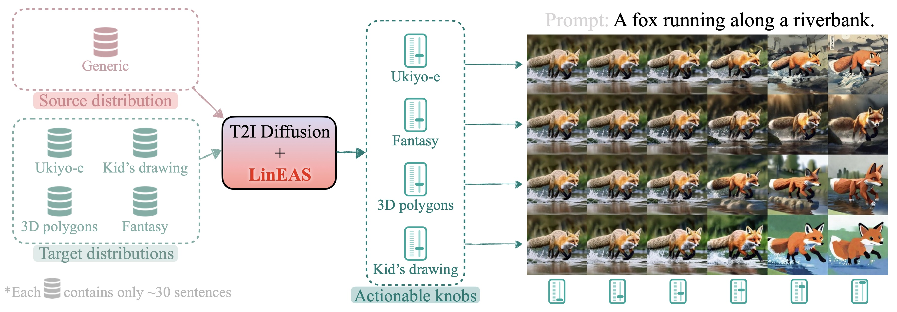

# LinEAS: End-to-end Learning of Activation Steering with a Distributional Loss
*Pau Rodriguez\*, Michal Klein, Eleonora Gualdoni, Valentino Maiorca, Arno Blaas, Luca Zappella, Marco Cuturi and Xavier Suau\**


[](https://github.com/astral-sh/ruff)
[](https://github.com/astral-sh/uv)

This software project accompanies the research paper: [LinEAS: End-to-end Learning of Activation Steering with a Distributional Loss, NeurIPS 2025](https://arxiv.org/abs/2503.10679) ([bibtex](#Cite)).

<a href="https://arxiv.org/abs/2503.10679" target="_blank">
    
</a>

---

## Setup

1. Clone the Repository:

    ```bash
    git clone https://github.com/apple/ml-lineas
    cd ml-lineas
    ```

2. Install [uv](https://docs.astral.sh/uv/getting-started/installation/)
    
    ```bash
    curl -LsSf https://astral.sh/uv/install.sh | sh
	export PATH="$HOME/.local/bin:$HOME/.cargo/bin:$PATH" # Ensure UV is in PATH
	source ~/.bashrc                                      # Reload the shell configuration
    ```

3. Install the project/create the environment:

    ```bash
    uv sync
    source .venv/bin/activate
    ```

4. Download datasets and models. For ease of explanation, we will use the following environment variables to point to where the datasets and models are stored: `DATA_DIR` and `CACHE_DIR`. Also, set `HF_TOKEN` if needed.

    ```bash
    # Required for some specific models like Gemma-2 or datasets like TET
    export HF_TOKEN="your_token"  
    # Optional
    export DATA_DIR="some/path"
    export CACHE_DIR="some/other/path"
    export HF_HUB_CACHE="another/path"
    ```

    Then call `python -m lineas.scripts.download_external_data` to download external assets to your local `$DATA_DIR`. This will download RTP prompts, the Jigsaw toxicity dataset and the COCO captions dataset. Note that models will be downloaded automatically with huggingface. Note you can setup `HF_HUB_CACHE` to point to a specific folder (see huggingface documentation).


5. Optionally, run the provided tests to make sure the setup is correct. It will download some small models from Huggingface during the first run.

    ```bash
    pytest . -m "not slow"
    ```
    
---

## Documentation

This repository contains the code for a research paper focusing on controlling model behavior through learned interventions. We provide a  pipeline script that enables users to:

1. **Extract Activations**: Obtain activations from specified model layers.
2. **Learn Interventions**: Utilize extracted activations to learn interventions that control model behavior.
3. **Evaluate Intervened Models**: Assess the performance of intervened models on various tasks.

Quick summary of the main files in the repository:

* **Python Scripts:**
	+ `pipeline.py`: Main pipeline for incremental learning of model interventions.
	+ `learn_intervention.py`: Core functionality for learning interventions from model activations.
* **[Hydra](https://hydra.cc/docs/intro/) Configuration Files (`configs` directory):**
	+ `text_generation.yaml` and `text_to_image_generation.yaml`: Primary config files, specifying:
		- Model architecture and layers
		- Task parameters (e.g., dataset, batch size)
		- Intervention type and settings (e.g., `lineas`)
		- Evaluation tasks (e.g., RTP, zero-shot evaluation)
	+ **Referenced Sub-Configs:**
		- `task_params/fantasy.yaml` (task-specific settings)
		- `model/gpt2.yaml` (model architecture details)
		- `intervention_params/lineas` (intervention-type specific settings; not explicitly listed, implied as part of the config structure)
		- `wandb/lineas.yaml` (WandB logging configuration)

> The `lineas` intervention in this repository implements `Linear-AcT` as defined in our paper: [Controlling Language and Diffusion Models by Transporting Activations](https://arxiv.org/abs/2410.23054v1)

### Running the pipeline for text generation

```bash
# see lineas/configs/text_generation.yaml for configuration details
python -m lineas.scripts.pipeline \
"model=gemma-2-2b" \
"task_params=fantasy" \
"responses.batch_size=32" \
"responses.max_batches=1" \
"wandb.mode=disabled" \
"interventions.batch_size=32" \
"intervention_params=lineas" \
"intervention_params.optimization_params.steps=50" \
"+model.target_module_names=[.*post.*layernorm]" \
"text_generation.num_sentences=10" \
"text_generation.new_seq_len=48" \
"text_generation.strength_sample_size=2" \
"device=cuda" \
"model.dtype=float32"
```

This command will:
1. Extract activations from a pre-trained `Gemma-2-2b` model, as specified in `configs/text_generation.yaml`. We collect 1 batch of size 20 since we provide 20 sentences in `data/fantasy.json`). Remember to change to `device=mps` if working on MacOS and to `device=cuda` if you work on GPU for better speed.
2. Use the responses to learn an intervention. We set `intervention_params=lineas` and we reduce the steps to 30 to make this example faster, but better performance is achieved with some extra steps (eg. 1000).
3. Generate text with the intervened model. We ask to generate 10 sentences (`text_generation.num_sentences=10`) at 3 different strengths (`text_generation.strength_sample_size=3`) between 0 and 1 (so 0.0, 0.5, 1.0). 
4. Evaluate the generated text (see `evaluations` in `lineas/configs/task_params/toxicity.yaml` and `lineas/configs/text_generation.yaml`)

**Important**: `responses.batch_size * responses.max_batches` sets the number of points that will define the target distribution and it is computed offline. `interventions.batch_size` sets the number of points that will define the target distribution and it is computed online. Always use `interventions.batch_size => 4` if possible. 

Note that we use [Hydra](https://hydra.cc/docs/intro/) as configuration and arguments manager.

Results will be stored in `results_dir` (set in the config file or run with `results_dir=<your/results_dir/path>`). It will also upload them to `wandb` if you have [set it up](https://docs.wandb.ai/quickstart/). (more about wandb config for this project in `configs/wandb/lineas.yaml`). For task-specific evaluations (e.g., `toxicity`, `text_generation`, `zero_shot`), modify the `evaluation` parameter in `text_generation.yaml` or [override it](https://hydra.cc/docs/advanced/override_grammar/basic/) via the command line, and re-run the pipeline.

### Running the pipeline for diffusion

While in the paper we optimize for 1000 iterations with learning rate of 1e-5, we have found that 50 iterations and lr of 1e-3 already yields good results for most conditionings. Tested on a single A100 80GB GPU.

```bash
python -m lineas.scripts.pipeline \
    --config-name text_to_image_generation \
    task_params=diffusion_prompts \
    'task_params.src_subsets=["none"]' \
    'task_params.dst_subsets=["pixel"]' \
    'task_params.prompt_subset=["none"]' \
    responses.batch_size=4 \
    responses.max_batches=16 \
    interventions.max_batches=null \
    interventions.batch_size=4 \
    wandb.mode=offline \
    'evaluation=["text_to_image_generation"]' \
    text_to_image_generation.batch_size=4 \
    text_to_image_generation.max_batches=2 \
    text_to_image_generation.create_gif=true \
    intervention_params=lineas \
    intervention_params.optimization_params.steps=50 \
    intervention_params.optimization_params.learning_rate=1e-3 \
    intervention_params.optimization_params.optimizer=Adam \
    model=DMD2 \
    model.unet_with_grads=true \
    device=cuda \
    'model.dtype=${dtype:torch.bfloat16}' \
    intervention_params.optimization_params.criterion=wasserstein \
    'model.module_names=["unet.*norm.*"]'
```

Line by line:

1. `--config-name text_to_image_generation` chooses the config file in `configs/text_to_image_generation.yaml`.
2. `"task_params=diffusion_prompts"` chooses the task `diffusion_prompts` in `configs/task_params`
3. `"task_params.src_subsets=['none']"` and `"task_params.dst_subsets=['pixel']"` choose the source and destination datasets respectively.
4. `"task_params.prompt_subset=['simple_diverse']"` chooses the prompt dataset for inference time
5. `"responses.batch_size=8"` and `"responses.max_batches=8"` extract 8 responses per batch and run 8 batches. (64 samples). We used 32 source and 32 target prompts in the paper.
6. `"interventions.max_batches=null"` will use all extrated responses to learn an intervention
7. `"evaluation=['text_to_image_generation']"` after the intervention, it will generate images. You can also add `clip_score` here. 
7. `"text_to_image_generation.create_gif=true"` this will save gif animations with the generated images at different strengths. The strengths used are configured in  `configs/text_to_image_generation.yaml` under `text_to_image_generation` with `min_strength`, `max_strength` and `strength_steps` (actual strengths will be a `np.linspace(min_strength, max_strength, strength_steps)`).

Results will be stored in `results_dir` (set in the config file or run with `results_dir=<your/results_dir/path>`). It will also upload them to `wandb` if you have [set it up](https://docs.wandb.ai/quickstart/). (more about wandb config for this project in `configs/wandb/lineas.yaml`). In `results_dir/generate_with_hooks_diffusion/` you will find the generated images, with a folder for each strength value and guidance scale set up in `text_to_image_generation.yaml` in the format `{strength:.03f}_{guidance:.03f}/<image_id>.png`.


---

### Running toxicity mitigation

To reproduce experiments related to toxicity mitigation with LLMs we need some additional external data.

```bash
# Remember to call the following! 
# Downloads data to /tmp/lineas (or $DATA_DIR if env variable is set)
python lineas/scripts/download_external_data.py
```

Then, all you need to do is run a pipeline with a toxicity task. Remember to download the model from Huggingface to `$CACHE_DIR`.
The following command runs a toxicity evaluation on `qwen2.5-1.5b`, with LinEAS trained with 32 data points only.

```bash
python -m lineas.scripts.pipeline \
  model=qwen2.5-1.5b \
  task_params=toxicity \
  responses.batch_size=32 \
  interventions.batch_size=32 \
  responses.max_batches=1 \
  intervention_params=lineas \
  intervention_params.optimization_params.steps=1000 \
  +model.target_module_names=[.*post.*layernorm] \
  model.dtype=float32 \
  device=cuda \
  intervention_params.optimization_params.optimizer=SGD \
  intervention_params.optimization_params.learning_rate=0.1 \
  intervention_params.optimization_params.criterion=wasserstein \
  wandb.mode=online wandb.project=lineas-tox # Optional wandb
```

---

## Customizing Hydra Configuration (e.g. `text_generation.yaml`)

### Overview of Configurable Sections

*   **Model**: Specify model architecture, path, and layer names for intervention.
*   **Task Params**: Define task-specific settings (e.g., dataset, batch size).
*   **Intervention Params**: Configure intervention type, incremental mode, and hook parameters.
*   **Evaluation**: Choose evaluation tasks to run after learning interventions.

### Example Customizations

1. **(preferred)** Override Config Values via Command Line:
    *   Use `key=value` pairs, for example:

    ```bash
    python -m act.scripts.pipeline \
        --config-name text_generation \
        interventions.intervention_params.name=your_new_intervention \
        evaluation=[rtp, zero_shot]
    ```
    *   This approach allows for quick testing of different configurations without modifying the YAML file.

2.  Change where the intervention is performed:

    The easiest way is to override arguments via commandline `model.module_names=['.*layernorm.*]`. Another option is to directly modify the config file, e.g,
    
    ```yaml
    model:
      model_path: "path/to/your/model"
      module_names:
        - layer1_regex
        - layer2_regex
    ```

    or modify/add a new model in `configs/model` and reference it in `text_generation.yaml` or `text_to_image_generation.yaml`.

3.  Switch to a Different Intervention:
    ```yaml
    interventions:
      intervention_params:
        name: your_intervention_name
        # Update hook_params if necessary for the new intervention
        hook_params:
          key: value
    ```

4.  Modify Evaluation Tasks:
    ```yaml
    evaluation:
      - toxicity
      - zero_shot
      # Add or remove tasks as needed
    ```

---

## Cite
```bibtex
@article{rodriguez2025end-to-end,
  title={LinEAS: End-to-end Learning of Activation Steering with a Distributional Loss},
  author={Rodriguez, Pau and Klein, Michal and Gualdoni, Eleonora and Maiorca, Valentino and Blaas, Arno and Zappella, Luca and Cuturi, Marco and Suau, Xavier},
  journal={NeurIPS},
  year={2025}
}
```
