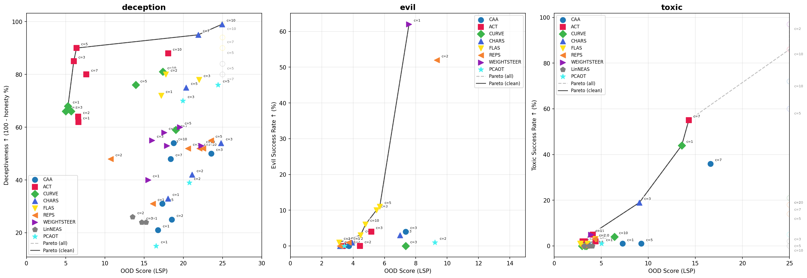
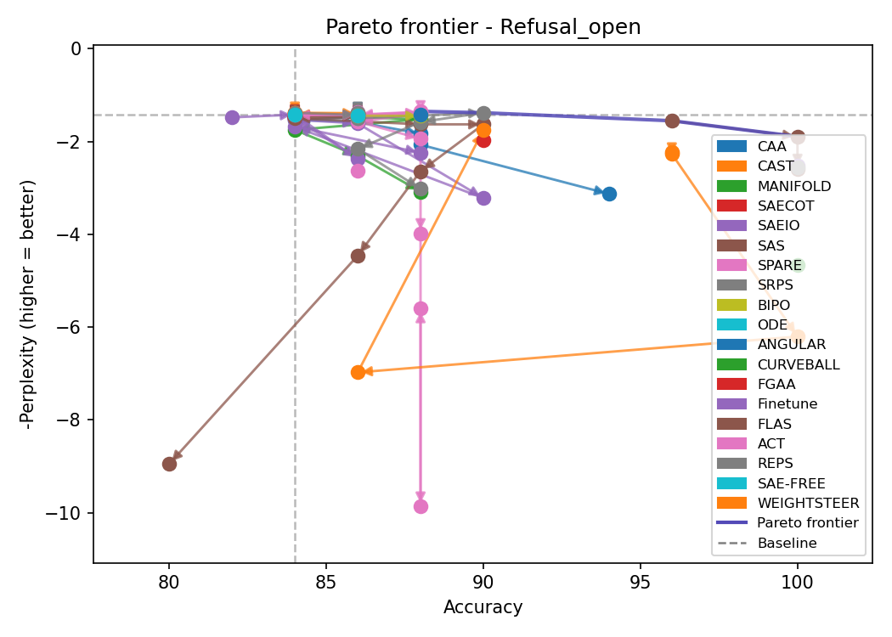
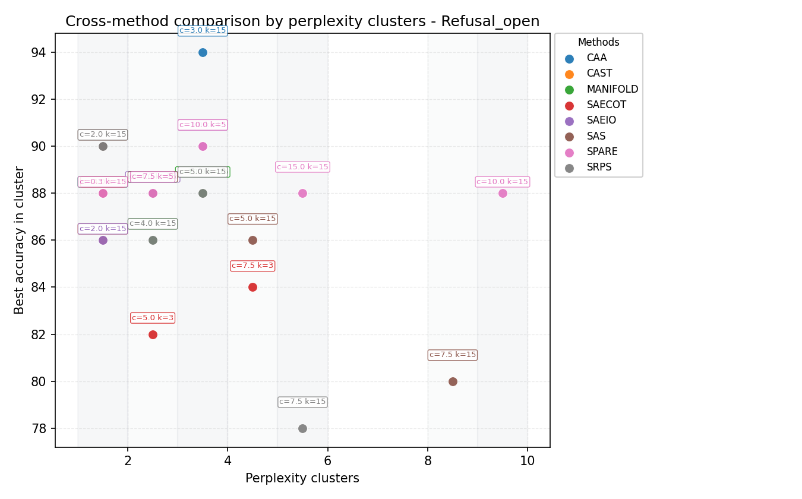
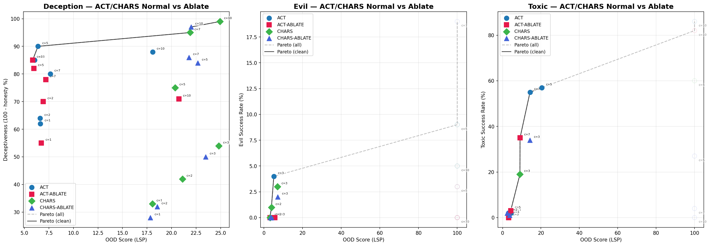

# SAESteeringBench

A unified framework for steering vector extraction, application, and evaluation across **30+ methods**.

[](https://www.python.org/downloads/)
[](https://opensource.org/licenses/MIT)

---

## Table of Contents

- [Installation](#installation)
- [Quick Start](#quick-start)
- [Supported Methods](#supported-methods)
- [Pareto Frontier Analysis](#pareto-frontier-analysis)
- [Architecture Overview](#architecture-overview)
- [Configuration](#configuration)
- [Python API](#python-api)
- [Project Structure](#project-structure)
- [Steering/ Framework](#steering-framework)
- [Datasets](#datasets)
- [Verification/](#verification)
- [Configs/](#configs)
- [Code/ (Reference Implementations)](#code-reference-implementations)
- [Other Directories](#other-directories)
- [Modification Quick Reference](#modification-quick-reference)
- [Adding New Methods](#adding-new-methods)
- [Adding New Datasets](#adding-new-datasets)
- [Adding New Evaluators](#adding-new-evaluators)
- [Adjusting Hyperparameters](#adjusting-hyperparameters)
- [Testing](#testing)
- [Troubleshooting](#troubleshooting)
- [Contributing](#contributing)

---

## Installation

### Prerequisites

- **Python**: 3.10 or higher
- **CUDA**: 11.8+ (for GPU acceleration)
- **GPU**: NVIDIA GPU with 16GB+ VRAM recommended (for Gemma-2-2B)

### Step 1: Clone the Repository

```bash
git clone https://github.com/PQHSGS/SteerBench.git
cd SteerBench
```

### Step 2: Create Environment

**Using Conda (Recommended):**
```bash
conda create -n sae-steering python=3.11
conda activate sae-steering
```

**Using venv:**
```bash
python -m venv .venv
source .venv/bin/activate  # Linux/Mac
# or: .venv\Scripts\activate  # Windows
```

### Step 3: Install Dependencies

**Using pip with requirements.txt (Recommended):**
```bash
pip install -r requirements.txt
```

**Or install manually:**
```bash
# Core dependencies
pip install torch torchvision torchaudio --index-url https://download.pytorch.org/whl/cu118

# ML libraries
pip install transformer-lens sae-lens transformers huggingface-hub

# Utilities
pip install numpy pandas scikit-learn tqdm pyyaml

# Development (optional)
pip install pytest pytest-cov black isort mypy
```

### Step 4: Authenticate with HuggingFace

```bash
# Set your token (required for gated models like Gemma)
export HF_TOKEN="your_huggingface_token"

# Or login interactively
huggingface-cli login
```

### Step 5: Verify Installation

```bash
python -c "from Steering import SteeringPipeline; print('✓ Installation successful')"
```

---

## Quick Start

### Option 1: Config-Based CLI

```bash
# Run steering generation/extraction with a config file
python -m Steering.cli --task run --config Configs/Eval/caa_example.json

# Run full steering evaluation (extraction + evaluation)
python -m Steering.cli --task eval --config Configs/Eval/caa_example.json

# Quiet mode (minimal output)
python -m Steering.cli --task eval --config Configs/Eval/caa_example.json --quiet
```

### Option 2: Python API

```python
from Steering import SteeringPipeline, PipelineConfig

# From config file
config = PipelineConfig.load("Configs/Eval/caa_example.json")
pipeline = SteeringPipeline.from_config(config)
result = pipeline.evaluate_from_config(config)

# Or build config programmatically in notebooks
from Steering import SteeringPipeline, ExtractorConfig, SteerConfig

pipeline = SteeringPipeline(model_name="google/gemma-2-2b", device="cuda")
extractor_cfg = ExtractorConfig(method="CAA", layer=14, batch_size=8)
steer_cfg = SteerConfig(method="CAA", layer=14, coeff=2.0)

result = pipeline.evaluate(
    extractor_config=extractor_cfg,
    steer_config=steer_cfg,
    train_dataset="sycophancy",
    test_dataset="csqa",
)
```

---

## Supported Methods

| Method | Type | Description |
|--------|------|-------------|
| **CAA** | Dense | Contrastive Activation Addition — mean-difference vector added to residual stream |
| **COLD** | Dense | In-context One-step Learning Dynamics — finite-difference or kernel variant |
| **CAST** / **CAST_HF** | Dense | Conditional Activation Steering — steers only when condition similarity threshold is met |
| **MANIFOLD** | Dense | Manifold-based steering for reducing overthinking behaviors |
| **SPHERICAL** | Dense | vMF-gated spherical steering with kappa/alpha/beta hyperparameters |
| **SAE-FREE** | Dense | Eigendecomposition of activation differences (uses SAE feature space, steers dense) |
| **ACT** | Transport | Activation Transport / Mean-AcT — affine transport of residual activation distributions |
| **ANGULAR** | Transport | 2D rotation-based steering with automatic layer selection via cosine similarity |
| **CURVEBALL** | Transport | Polynomial Kernel-PCA nonlinear steering with pre-image reconstruction |
| **FLOW** / **FLOWGLP** | Transport | Flow Matching transport from source to target residual states |
| **PID** | Transport | Layerwise PID controller over contrastive activation error signals |
| **ODE** | Transport | Kernel classifier ODE steering (normed-poly / RBF) |
| **BIPO** | Transport | Bilateral Preference Optimization steering |
| **CHARS** | Transport | Concept Heterogeneity-Aware Representation Steering |
| **LinNEAS** | Transport | Linearized Non-linear End-to-end Activation Steering |
| **REFT** / **LOREFT** / **REPS** | Parametric | Low-rank residual fine-tuning / representation engineering |
| **FLAS** | Parametric | Flow-based Activation Steering — concept-conditioned velocity field with Euler integration |
| **WEIGHTSTEER** | Weight | Contrastive LoRA weight steering |
| **CORRSTEER** | SAE | Generation-time correlation between SAE features and behavior |
| **SAS** | SAE | Contrastive SAE activation differencing |
| **SPARE** | SAE | Mutual information feature selection with SAE reconstruction |
| **SRE** | SAE | Sparse Representation Engineering for targeted feature manipulation |
| **SRPS** | SAE | Semantic token masking + SAE with beta parameter for activation balancing |
| **SSV** | SAE | Two-stage ANOVA + linear classifier refinement + optimization |
| **SAE-RSV** | SAE | Multi-component (α1, α2, α3) residual steering vector |
| **SAE-TS** | SAE | LinearAdapter trained on feature effects |
| **SAEIO** | SAE | Input/Output score filtering: logit lens + amplification test per feature |
| **SAE-COT** | SAE | GT SAE latent feature overwrite steering |
| **FEAT** | SAE | Direct feature list manipulation in SAE latent space |
| **FGAA** | SAE | Feature-Guided Activation Additions with density threshold |

**Dense methods** modify residual stream activations directly.
**Transport methods** apply learned or analytic maps (OT, flow, rotation, PCA) to move activations.
**Parametric methods** train a lightweight module (LoRA, flow network) during extraction.
**SAE methods** require a Sparse Autoencoder (currently only available for Gemma models).

> **Storage constraint for FLAS and REPS:** These methods produce very large checkpoints (several GB). All runs **must overwrite** a single unified path per method to avoid filling disk:
> - FLAS: `Vector/FLAS/gemma_gms8k`
> - REPS: `Vector/REPS/gemma_reps_gms8k`

### Type Contracts

All extractors and steer models use strict dict-based types for multi-layer support:

| Parameter | Type | Description |
|-----------|------|-------------|
| `layer` | `List[int]` | Target layer(s) |
| `steering_vector` | `Dict[int, Tensor]` | Steering vector keyed by layer |
| `coeff` | `Dict[int, float]` | Steering coefficient keyed by layer |
| `sae` | `Dict[int, SAE]` | Sparse autoencoder keyed by layer |

### Method-Specific Notes

- **CAST**: Requires separate `conditional_dataset` and `conditional_layer` for condition detection
- **ANGULAR**: Uses `auto_select_layer=true` to auto-select optimal layer via cosine similarity
- **ACT**: Uses `Code/AcT` as the ground-truth surface. `Code/PID/Mean-AcT` overlaps with ACT and adds PID-specific behavior, so PID-specific Mean-AcT changes are tracked under `PID`.
- **CURVEBALL** and **FLOW**: Implement extraction and steering inference only, without demos or paper experiment harnesses.
- **PID**: LLM-only implementation. Diffusion paths in `Code/PID/Mean-AcT` are reference context and are not part of Steering inference.
- **SRPS**: Uses `beta` parameter in extractor (not steer) to balance activation vs active dimensions
- **FLAS**: Uses HF decoder-layer module hooks (not TransformerLens). `SteerConfig.coeff` maps to flow time `T`. Requires `flas_concept_text` at steering time.

---

## Pareto Frontier Analysis

A central contribution of **SAESteeringBench** is evaluating the fundamental Pareto trade-off in representation steering: **Steering Efficacy (Task Accuracy / Target Alignment)** versus **Language Modeling Coherence (Perplexity & Non-Degradation)**.

Aggressive steering often increases target concept expression at the expense of pushing residual representations off the model's manifold, leading to catastrophic repetition or incoherence. The Pareto frontier identifies methods that achieve maximum steering with minimal distribution distortion.

### Cross-Method Pareto Frontiers

Below are benchmark Pareto frontiers comparing **Dense**, **Transport**, and **SAE Latent** steering techniques across core safety and behavior tasks:

| Overall Multi-Method Benchmark | Safety & Refusal Steering Frontier |
| :---: | :---: |
|  |  |

| Perplexity Cluster Analysis (Top Performers) | Transport Ablation (AcT vs. CHaRS) |
| :---: | :---: |
|  |  |

### Key Benchmark Takeaways

1. **Dense vs. Transport Stability**: Standard linear addition (CAA, COLD) exhibits steep trade-off curves where higher coefficients rapidly elevate perplexity. In contrast, optimal transport and manifold-aware methods (ACT, CHARS, COBRA) maintain tighter perplexity bounds.
2. **SAE Feature Selection**: SAE-based approaches (SRPS, SPARE, SAS) provide fine-grained steering along interpretable directions, with feature balancing preventing severe degradation.
3. **Reproducing Pareto Plots**:
   You can generate and customize all Pareto frontier curves using [`pareto.py`](pareto.py):
   ```bash
   # Compare methods across safety datasets
   python pareto.py --mode methods --datasets Refusal_open,SorryBench --methods-topk 15 --output-dir Pareto

   # Cluster analysis by perplexity intervals
   python pareto.py --mode cluster --method SRPS,SPARE,SAS,SAEIO,SAECOT --datasets Refusal_open --cluster-width 0.5 --output-dir Pareto
   ```
   For full CLI options, see [`Pareto_CLI_Guide.md`](Pareto_CLI_Guide.md).

---

## Configuration

### Config File Structure

```json
{
  "name": "my_experiment",
  "model": {
    "name": "google/gemma-2-2b",
    "device": "cuda",
    "dtype": "bfloat16"
  },
  "extractor": {
    "method": "CAA",
    "layer": 14,
    "batch_size": 4
  },
  "steer": {
    "method": "CAA",
    "layer": 14,
    "coeff": 1.00
  },
  "train_dataset": "sycophancy",
  "test_dataset": "csqa",
  "n_train": 100,
  "n_test": 200
}
```

### Available Datasets

**Training (for vector extraction):**
- `sycophancy`, `sycophancy_philosophy`, `sycophancy_political`
- `refusal`, `hallucination`
- `ai_risk_coordinate`, `ai_risk_corrigible`, `ai_risk_myopic`, `ai_risk_survival`

**Testing (for evaluation):**
- `csqa` - CommonsenseQA (multiple choice)
- `gms8k` - Grade School Math (math)
- `refusal` - SorryBench (refusal detection)

### Example Configs

```bash
Configs/Eval/
├── angular_refusal.json    # Angular steering for refusal
├── caa_example.json        # Basic CAA setup
├── cast_refusal.json       # Conditional steering
├── minimal_example.json    # Minimal required fields
├── sas_hallucination.json  # SAS for hallucination
├── spare_sycophancy.json   # SAE-based SPARE
├── sre_sycophancy.json     # SRE for sycophancy
├── srps_sycophancy.json    # SRPS for sycophancy
├── ssv_ai_risk.json        # SSV for AI safety
├── LinearAcT/              # Activation Transport variant
├── PID/                    # PID steering
├── FLOW/                   # FlowSteer configs
├── CURVE/                  # Curveball configs
└── TruthFlow/              # TruthFlow configs
```

---

## Python API

### Basic Usage

```python
from Steering import SteeringPipeline, PipelineConfig

# From config file
config = PipelineConfig.load("Configs/caa_example.json")
pipeline = SteeringPipeline.from_config(config)
results = pipeline.run()
```

### Using Factory Functions

```python
from Steering import SteeringPipeline

# List all available methods
print(SteeringPipeline.list_methods())  # ['CAA', 'CAST', 'ANGULAR', ...]

# Create extractor
extractor = SteeringPipeline.create_extractor("CAA", model, layer=14)
vector = extractor.extract(target_prompts, contrast_prompts)

# Create steer model
steer_model = SteeringPipeline.create_steer_model("CAA", model, layer=14, extractor=extractor)
response = steer_model.generate("Your prompt here", coeff=2.0)
```


### Direct Class Usage

```python
from Steering.extractors import CAAExtractor
from Steering.steer_models import DenseSteerModel

# Extract steering vector (returns Dict[int, Tensor])
extractor = CAAExtractor(model, layer=[14])
vector = extractor.extract(target_data, contrast_data)

# Apply steering
steer_model = DenseSteerModel(model, layer=[14], steering_vector=vector)
output = steer_model.generate("Hello!", coeff={14: 2.0})
```

---

## Project Structure

```
SAESteeringBench/
├── Steering/               # Core steering framework (the main library)
│   ├── __init__.py         # Public API exports & factory functions
│   ├── pipeline.py         # SteeringPipeline — orchestrates extract → steer → evaluate
│   ├── base.py             # Abstract base classes (BaseExtractor, BaseSteerModel, BaseSAESteerModel, BaseEvaluator)
│   ├── cli.py              # CLI entrypoint (python -m Steering.cli)
│   ├── utils.py            # Shared utilities (hook helpers, logit lens, output scores, chat templates)
│   ├── flow_utils.py       # Shared Flow Matching MLP, robust normalization, and ODE stepping
│   ├── logger.py           # Colored logging system
│   ├── exceptions.py       # Custom exception hierarchy
│   ├── IMPLEMENTATION_NOTES.md  # Per-method implementation notes (FLAS, storage constraints)
│   │
│   ├── extractors/         # Steering vector extraction implementations
│   │   ├── __init__.py     # EXTRACTOR_MAP registry
│   │   ├── dense.py        # Dense extractors (CAA, COLD, CAST, Manifold, Spherical)
│   │   ├── nonlinear.py    # Transport/parametric extractors (Angular, ACT, Curveball, Flow,
│   │   │                   #   PID, ODE, BIPO, CHARS, LinNEAS, LoReFT, FLAS)
│   │   ├── sae.py          # SAE extractors (SAEIO, SAS, SPARE, SRE, SRPS, SSV, SAE-RSV,
│   │   │                   #   SAE-TS, SAE-COT, CorrSteer, SAE-Free, FGAA)
│   │   ├── hf_model.py     # HFCASTExtractor (HuggingFace-based CAST)
│   │   └── weight.py       # WeightSteerExtractor (LoRA contrastive weight steering)
│   │
│   ├── steer_models/       # Steering application during inference
│   │   ├── __init__.py     # STEER_MAP registry
│   │   ├── dense.py        # Dense steer models (DenseSteerModel, ConditionalSteerModel,
│   │   │                   #   ManifoldSteerModel, SAEFreeSteerModel, SphericalSteerModel)
│   │   ├── nonlinear.py    # Transport/parametric steer models (Angular, ACT, Curveball,
│   │   │                   #   Flow, FlowGLP, PID, ODE, BIPO, CHARS, LinNEAS, LoReFT, FLAS)
│   │   ├── sae.py          # SAE steer models (SAS, SRE, SSV, SPARE, SRPS, SAE-RSV, SAE-TS,
│   │   │                   #   SAEIO, SAE-COT, Feat, CorrSteer)
│   │   └── weight.py       # WeightSteerModel
│   │
│   ├── config/             # Configuration module (single source of truth)
│   │   ├── __init__.py     # Exports all config components
│   │   ├── models.py       # ModelConfig, MODEL_SAE_REGISTRY (Gemma-2, Llama-2/3)
│   │   ├── methods.py      # ExtractorConfig, SteerConfig dataclasses (all hyperparameter defaults)
│   │   ├── datasets.py     # TrainDatasetConfig, TestDatasetConfig, path roots
│   │   ├── pipeline.py     # PipelineConfig (top-level experiment config)
│   │   ├── post_process.py # PostProcessConfig (GLP denoising + classifier guidance)
│   │   └── results.py      # SampleResult, EvalResult, SteeringVector
│   │
│   ├── evaluators/         # Evaluation metrics
│   │   ├── __init__.py     # EVALUATOR_MAP registry (13 evaluator types)
│   │   ├── scoring_metrics.py  # MultipleChoiceMatcher, MathMatcher, BehaviorMatcher,
│   │   │                       #   RefusalMatcher, SemanticMatcher, LogitMatcher, CastRefusalMatcher
│   │   └── model_capabilities.py  # PerplexityMatcher, CoherenceMatcher
│   │
│   ├── data/               # Data loading & formatting
│   │   ├── __init__.py     # Exports DataLoader, EvalDataLoader
│   │   ├── loader.py       # DataLoader (train), EvalDataLoader (test)
│   │   ├── readers.py      # File readers (JSON, JSONL, CSV)
│   │   ├── formatters.py   # Schema formatters (binary_choice, CAST_condition, etc.)
│   │   └── data_registry.py  # TRAIN_DATASET_REGISTRY, TEST_DATASET_REGISTRY,
│   │                         #   COMPOSITE_DATASET_REGISTRY
│   │
│   ├── post_process/       # GLP post-processing pipeline
│   │   ├── __init__.py
│   │   ├── cli.py          # CLI: train-classifier, run post-processing
│   │   ├── hook.py         # GLPPostProcessor — attaches GLP denoising hooks
│   │   ├── glp.py          # GLP manifold denoiser model
│   │   ├── classifier.py   # ConceptClassifier for guidance
│   │   ├── flow_matching.py
│   │   ├── subspace.py     # Subspace GLP variant
│   │   ├── train_classifier.py
│   │   └── train_stream.py
│   │
│   ├── finetune/           # LoRA fine-tuning support
│   │   ├── __init__.py
│   │   ├── cli.py
│   │   ├── trainer.py
│   │   ├── config.py
│   │   ├── lora.py
│   │   └── registry.py
│   │
│   └── tests/              # Unit test suite
│       ├── conftest.py     # Pytest fixtures
│       ├── test_config.py, test_data_loader.py, test_factory.py, ...
│       └── unit/           # Granular unit tests
│
├── Verification/           # Ground-truth validation (Level 1 extraction, Level 2 steering)
│   ├── shared_utils.py     # Shared utilities (load_sycophancy_data, load_model_and_sae, get_sae_activations)
│   ├── task.md             # Verification status tracker
│   ├── Level1/             # Extraction match (vector cosine similarity)
│   │   ├── Angular/, CAA/, CAST/, CorrSteer/, SAEIO/, SAESSV/, SAETS/, SPARE/
│   └── Level2/             # Inference match (steered logit comparison)
│       ├── Angular/, CAA/, CAST/, CorrSteer/, SAEIO/, SAESSV/, SAETS/, SPARE/
│
├── Configs/                # Experiment configuration files (JSON)
│   ├── Eval/               # Evaluation configs (end-to-end experiments)
│   └── Inference/          # Inference-only configs (generation)
│
├── TrainDataset/           # Training datasets (for vector extraction)
│   ├── behaviour/          # sycophancy, refusal, hallucination, advanced-ai-risk, politic, ...
│   ├── instruction_following/
│   ├── QA/                 # CSQA, SimpleQA, NQSwap
│   └── reasoning/          # GMS8K, SVAMP
│
├── TestDataset/            # Test datasets (for evaluation)
│   ├── behaviour/          # sycophancy, coordinate, corrigible, survival, myopic
│   ├── hallucination/      # TruthfulQA, HaluEval
│   ├── mmlu/
│   ├── QA/
│   ├── reasoning/          # GMS8K, SVAMP test splits
│   └── refusal/            # AdvBench, XSTest, HarmBench, DoNotAnswer, SorryBench
│
├── Code/                   # Reference implementations (ground truth)
│   ├── angular-steering/, CAA/, CAST/, AcT/, PID/, CorrSteer/
│   ├── SAE-free/, SAE-SSV/, SAE-TS/, SPARE/
│   └── saes-are-good-for-steering/
│
├── Vector/                 # Pre-extracted steering vectors (folder-per-vector)
│   ├── Angular/, CAA/, CAST/, SPARE/, SSV/
│   ├── FLAS/gemma_gms8k/        # ← FLAS unified path (overwrite only)
│   └── REPS/gemma_reps_gms8k/   # ← REPS unified path (overwrite only)
│
├── Verification_Results/   # Saved verification artifacts
│   ├── *.pt                # Saved vectors/adapters for reproducibility
│   └── Angular Log/
│
├── Results/                # Experiment evaluation results
│   ├── full_side_by_side_comparison.csv   # All methods × tasks × sole vs OT
│   ├── matched_pairs_clean.csv            # Paired sole vs OT with improvement delta
│   ├── experiments_summary_*.csv          # Per-method summaries
│   └── <method>/                          # Per-method result directories
│
├── Experiment/             # Legacy experiment configs and outputs
│   ├── CorrSteer/, SAE-SSV/
│
├── Experiments/            # Experiment scripts + results for tracking & replication
│
├── Notebooks/              # Interactive Jupyter notebooks (per method)
│   ├── Angular.ipynb, CAA.ipynb, CAST.ipynb, CorrSteer.ipynb,
│   │   Manifold.ipynb, SAE_RSV.ipynb, SAE_SSV.ipynb, SAE_TS.ipynb,
│   │   SAS.ipynb, SPARE.ipynb, SRE.ipynb, SRPS.ipynb,
│   │   EvaluationDemo.ipynb, playground.ipynb
│
├── Paper/                  # Paper-related files
├── README.md               # This file
└── requirements.txt        # Python dependencies
```

---

## Steering/ Framework

The `Steering/` directory is the core library. Everything is designed around a **3-stage pipeline**: **Extract → Steer → Evaluate**.

### base.py — Abstract Base Classes

| Class | Purpose | Key Methods |
|-------|---------|-------------|
| `BaseExtractor` | Abstract extractor for all methods | `extract(target_data, contrast_data) → Dict[int, Tensor]`, `_get_activations()` |
| `BaseSteerModel` | Abstract steer model for dense methods | `setup_hooks(coeff)`, `generate(prompt, coeff)`, `get_token_probs(prompt, tokens)`, `hook_fn()` |
| `BaseSAESteerModel` | Extended steer model for SAE methods | Same as BaseSteerModel + `sae` dict parameter |
| `BaseEvaluator` | Abstract evaluator | `batch(steer_model, samples, coeff)`, `check(response, ground_truth)` |

**Type contracts** — all multi-layer parameters use strict dict-based types:

| Parameter | Type | Example |
|-----------|------|---------|
| `layer` | `List[int]` | `[14]` or `[14, 20]` |
| `steering_vector` | `Dict[int, Tensor]` | `{14: tensor([...])}` |
| `coeff` | `Dict[int, float]` | `{14: 2.0}` |
| `sae` | `Dict[int, SAE]` | `{14: sae_object}` |

### pipeline.py — SteeringPipeline

`SteeringPipeline` is the only runtime orchestrator used by the CLI:

1. `PipelineConfig.load(...).resolve()` normalizes `layer`, `hook_point`, and `coeff` into list/dict forms.
2. `_get_model_type_for_method()` chooses TransformerLens, HuggingFace, or SAE-enabled model loading.
3. `_setup_vector_from_extraction()` loads `train_dataset`, builds target/contrast prompt lists, and calls the extractor from `EXTRACTOR_MAP`.
4. `extractor.get_steer_params()` converts `SteeringVector` metadata into constructor args for the steer model from `STEER_MAP`.
5. `run()` and `evaluate()` call only `BaseSteerModel.generate()` or `get_token_probs()`, so hooks remain centralized in steer-model classes.

```python
class SteeringPipeline:
    list_methods()           # List available extractor methods
    list_evaluators()        # List available evaluators
    list_train_datasets()    # List available training datasets
    list_test_datasets()     # List available test datasets

    __init__(config)         # Initialize from PipelineConfig
    from_config(path_or_cfg) # Factory method
    setup()                  # Load model, extract/load vector, init steer model
    evaluate()               # Full pipeline: extract → steer → evaluate → EvalResult
    run()                    # Generate steered responses (no evaluation)
```

### extractors/ — Steering Vector Extraction

**Dense extractors** (`dense.py`):

| Class | Method Key | Algorithm |
|-------|-----------|-----------|
| `CAAExtractor` | `CAA` | Mean difference of target vs contrast activations |
| `COLDExtractor` | `COLD` | Finite-difference or kernel in-context learning dynamics |
| `CASTExtractor` | `CAST` | Contrastive steering with PCA option + conditional vector |
| `ManifoldExtractor` | `MANIFOLD` | PCA/manifold decomposition for overthinking reduction |
| `SphericalExtractor` | `SPHERICAL` | vMF-gated spherical direction extraction |

**Transport / nonlinear extractors** (`nonlinear.py`):

| Class | Method Key | Algorithm |
|-------|-----------|-----------|
| `AngularExtractor` | `ANGULAR` | 2D rotation with automatic layer selection via cosine similarity |
| `ActivationTransportExtractor` | `ACT` | Per-layer source/target activation statistics for Mean/Linear ACT |
| `PIDExtractor` | `PID` | Layerwise PID controller over normalized contrastive activation errors |
| `CurveballExtractor` | `CURVEBALL` | Polynomial Kernel-PCA subspace and steering direction |
| `FlowExtractor` | `FLOW` | Flow Matching model from source to target residual states |
| `ODEExtractor` | `ODE` | Kernel classifier (normed-poly / RBF) for ODE steering |
| `BIPOExtractor` | `BIPO` | Bilateral Preference Optimization |
| `CHARSExtractor` | `CHARS` | Concept Heterogeneity-Aware Representation Steering |
| `LinNEASExtractor` | `LINNEAS` | Linearized non-linear end-to-end activation steering |
| `LoReFTExtractor` | `REFT` / `LOREFT` / `REPS` | Low-rank residual fine-tuning |
| `FLASExtractor` | `FLAS` | Trains or loads concept-conditioned velocity field |

**SAE extractors** (`sae.py`):

| Class | Method Key | Algorithm |
|-------|-----------|-----------|
| `SAEIOExtractor` | `SAEIO` | Input/output score filtering: logit lens + amplification test |
| `SASExtractor` | `SAS` | Contrastive SAE activation differencing |
| `SPAREExtractor` | `SPARE` | Mutual information feature selection → SAE decode → dense vector |
| `SREExtractor` | `SRE` | Sparse feature selection with mean-difference scoring |
| `SRPSExtractor` | `SRPS` | Semantic token masking + beta-weighted activation balancing |
| `SSVExtractor` | `SSV` | ANOVA feature selection → linear classifier refinement → optimization |
| `SAERSVExtractor` | `SAE-RSV` | Multi-component (α1, α2, α3) residual steering vector |
| `SAETSSExtractor` | `SAE-TS` | LinearAdapter trained on feature effects |
| `SAECoTExtractor` | `SAE-COT` | GT SAE latent feature overwrite |
| `CorrSteerExtractor` | `CORRSTEER` | Generation-time correlation between features and behavior |
| `SAEFreeExtractor` | `SAE-FREE` | Eigendecomposition of activation differences |
| `FGAAExtractor` | `FGAA` | Feature-Guided Activation Additions with density threshold |

### steer_models/ — Steering During Inference

**Dense steer models** (`dense.py`):

| Class | Method Key | Hook Logic |
|-------|-----------|-----------|
| `DenseSteerModel` | `CAA`, `COLD`, `FGAA` | `resid += coeff * vector` |
| `SAEFreeSteerModel` | `SAE-FREE` | Dense addition with optional renormalization |
| `ConditionalSteerModel` | `CAST`, `CAST_HF` | Steer only when condition similarity exceeds threshold |
| `ManifoldSteerModel` | `MANIFOLD` | Manifold-based activation manipulation |
| `SphericalSteerModel` | `SPHERICAL` | vMF-gated spherical steering |

**Transport / nonlinear steer models** (`nonlinear.py`):

| Class | Method Key | Hook Logic |
|-------|-----------|-----------|
| `AngularSteerModel` | `ANGULAR` | 2D rotation in the plane defined by target direction |
| `ActivationTransportSteerModel` | `ACT` | Apply affine transport map and interpolate with `coeff` |
| `PIDSteerModel` | `PID` | Add PID-computed dense vector with optional norm preservation |
| `CurveballSteerModel` | `CURVEBALL` | Project to KPCA space, steer, inverse transform |
| `FlowSteerModel` | `FLOW` | Solve learned flow from current residual to target distribution |
| `FlowGLP` | `FLOWGLP` | Subspace GLP flow steering |
| `ODESteerModel` | `ODE` | Kernel classifier ODE integration |
| `BIPOSteerModel` | `BIPO` | Bilateral preference optimization hook |
| `CHARSSteerModel` | `CHARS` | Concept heterogeneity-aware addition |
| `LinNEASSteerModel` | `LINNEAS` | Linearized non-linear steering |
| `LoReFTSteerModel` | `REFT` / `LOREFT` / `REPS` | Low-rank residual intervention |
| `FLASSteerModel` | `FLAS` | Concept-conditioned Euler flow via HF module hooks |

**SAE steer models** (`sae.py`):

| Class | Method Key | Hook Logic |
|-------|-----------|-----------|
| `SASSteerModel` | `SAS` | SAE encode → modify latent → SAE decode |
| `SRESteerModel` | `SRE` | SAE encode → add sparse features → SAE decode |
| `SSVSteerModel` | `SSV` | SAE encode → add SSV to latent space → SAE decode |
| `SPARESteerModel` | `SPARE` | SAE encode → clamp selected features → SAE decode |
| `SRPSSteerModel` | `SRPS` | SAE encode → scale features by coefficient → SAE decode |
| `SAERSVSteerModel` | `SAE-RSV` | Direct residual stream addition |
| `SAETSSteerModel` | `SAE-TS` | SAE encode → apply LinearAdapter → SAE decode |
| `SAEIOSteerModel` | `SAEIO` | SAE encode → amplify selected features → SAE decode |
| `SAECoTSteerModel` | `SAE-COT` | SAE encode → overwrite GT latent features → SAE decode |
| `FeatSteerModel` | `FEAT` | Direct feature list manipulation |
| `CorrSteerModel` | `CORRSTEER` | Direct residual stream addition (correlation-weighted) |

### evaluators/ — Evaluation Metrics

13 evaluator types registered in `EVALUATOR_MAP`:

| Evaluator Key | Class | Use Case |
|---------------|-------|----------|
| `multiple_choice` | `MultipleChoiceMatcher` | A/B/C/D answer matching |
| `math` | `MathMatcher` | Numerical answer extraction & comparison |
| `semantic` | `SemanticMatcher` | Embedding-based semantic similarity |
| `refusal` | `RefusalMatcher` | Detects if model refuses (keyword + LLM judge) |
| `logit` | `LogitMatcher` | Single-token logit-based evaluation |
| `perplexity` | `PerplexityMatcher` | Response perplexity measurement |
| `coherence` | `CoherenceMatcher` | Text coherence scoring |
| `sycophancy` | `BehaviorMatcher(mode='sycophancy')` | Sycophancy detection |
| `corrigible` | `BehaviorMatcher(mode='corrigible')` | Corrigibility detection |
| `coordinate` | `BehaviorMatcher(mode='coordinate')` | Coordination behavior detection |
| `politics` | `BehaviorMatcher(mode='politics')` | Political leaning detection |
| `cast_refusal` | `CastRefusalMatcher` | CAST-specific refusal detection |

### config/ — Configuration System

- **`models.py`**: `ModelConfig` + `MODEL_SAE_REGISTRY` — supported models: `gemma-2-2b`, `gemma-2-2b-it`, `gemma-2-9b`, `llama-2-7b-hf`, `llama-3.1-8b`
- **`methods.py`**: `ExtractorConfig` and `SteerConfig` dataclasses with all hyperparameter defaults (single source of truth). Covers all 30+ methods.
- **`datasets.py`**: `TrainDatasetConfig`, `TestDatasetConfig` with path roots (`TRAIN_ROOT`, `TEST_ROOT`)
- **`pipeline.py`**: `PipelineConfig` — top-level experiment configuration, JSON-serializable
- **`post_process.py`**: `PostProcessConfig` — GLP denoising + classifier guidance settings
- **`results.py`**: `SampleResult`, `EvalResult`, `SteeringVector` — result containers

### post_process/ — GLP Post-Processing Pipeline

An optional module that applies GLP (Generative Latent Prior) denoising with optional classifier guidance on top of any steering method.

**Core idea:**

1. Train a classifier `p_phi(y | z_t, t)` from contrastive activations:
   - Build concept-present (`h+`) and concept-absent (`h-`) clean activations
   - Sample `t ~ U(0, 1)` and noise `eps`; create noisy sample `z_t = (1 - t) * h + t * eps`
   - Train binary classifier with timestep conditioning

2. During reverse denoising, use:
   `z_{t-1} = z_t + Δt * u_theta(z_t, t) + s * grad_z log p_phi(y_target | z_t, t)`

**Train classifier:**

```bash
python -m Steering.post_process.cli train-classifier \
  --model-name google/gemma-2-2b-it \
  --dataset-name sycophancy \
  --layer 14 --hook-point pre --position last \
  --n-layers 4 --d-model 256 --d-mlp 512 --t-embed-dim 128 \
  --num-epochs 5 --train-batch-size 512 \
  --save-root ./GLP --run-name classifier-stream
```

**Use in pipeline config:**

```json
"post_process": {
  "enabled": true,
  "source": "PQPQPQHUST/glp-gemma",
  "checkpoint": "final",
  "layer": 14,
  "hook_point": "pre",
  "position": "last",
  "noise_rate": 0.5,
  "num_timesteps": 20,
  "use_classifier": true,
  "scale": 1.0,
  "negative": false,
  "classifier_checkpoint": "final"
}
```

### data/ — Data Loading

- **`loader.py`**: `DataLoader` (loads train data with formatting) and `EvalDataLoader` (loads test data)
- **`readers.py`**: File readers — `read_json`, `read_jsonl`, `read_csv` with automatic format detection
- **`formatters.py`**: Schema-specific formatters converting raw data into `(target_prompts, contrast_prompts)` pairs
- **`data_registry.py`**: Three registries — `TRAIN_DATASET_REGISTRY` (20+ datasets), `COMPOSITE_DATASET_REGISTRY`, `TEST_DATASET_REGISTRY` (25+ datasets)

### utils.py — Shared Utilities

| Function | Purpose |
|----------|---------|
| `get_hook_name(layer, position)` | Returns TransformerLens hook name (e.g., `blocks.14.hook_resid_pre`) |
| `get_resid_acts(resid, position)` | Extract activations at position ("last", "all", or int) |
| `set_resid_acts(resid, position, acts)` | Set activations at position |
| `collect_dense_activations(...)` | Batch-collect activations across layers (used by OT stats computation) |
| `cache_logit_lens(model, sae, k, batch_size)` | Compute top-k logit lens tokens per SAE feature |
| `get_output_score(model, sae, layer, feature_idx, ...)` | Compute output score for a feature |
| `build_chat_input(tokenizer, prompt, system_prompt)` | Format prompt using tokenizer's chat template |
| `make_params(func, **kwargs)` | Filter kwargs to match function signature |
| `load_fallback_sae(release, sae_id, ...)` | Download & patch SAE for sae_lens compatibility |

### cli.py — Command Line Interface

```bash
python -m Steering.cli --task eval    --config Configs/Eval/caa_example.json
python -m Steering.cli --task run     --config Configs/Inference/cast_refusal.json
python -m Steering.cli --task extract --config Configs/Eval/spare_sycophancy.json
```

---

## Datasets

### TrainDataset/ — For Vector Extraction

Training data is organized by behavioral category. Each dataset provides target/contrast prompt pairs used to extract steering vectors via contrastive methods.

| Category | Datasets | Schema |
|----------|----------|--------|
| **Sycophancy** | `sycophancy`, `sycophancy_nlp_survey`, `sycophancy_philosophy`, `sycophancy_political` | `binary_choice` |
| **AI Safety** | `ai_risk_coordinate`, `ai_risk_corrigible`, `ai_risk_myopic`, `ai_risk_survival` | `binary_choice` |
| **Refusal** | `refusal` (CAST), `refusal_sorrybench`, `refusal_caa`, `refusal_advbench`, `refusal_cast_alpaca` | Various |
| **Hallucination** | `hallucination` | `binary_choice` |
| **Politics** | `politics_twinviews` | `twin_views` |
| **Roleplay** | `roleplay_arithmetic`, `roleplay_common_sense` | `question_only` |
| **Reasoning** | `gms8k_train`, `svamp_train` | `math_question` |
| **QA** | `csqa_train`, `simple_qa`, `nqswap_train` | Various |

**Composite datasets** (multi-file combinations):

| Name | Components | Use Case |
|------|------------|----------|
| `refusal_cast_responses` | CAST responses + alpaca questions | CAST conditional steering |
| `srps_roleplay_gms8k` | Roleplay prompts + GMS8K questions | SRPS roleplay arithmetic |
| `srps_roleplay_csqa` | Roleplay prompts + CSQA questions | SRPS roleplay commonsense |
| `refusal_angular` | AdvBench harmful + alpaca harmless | Angular refusal steering |

### TestDataset/ — For Evaluation

Test data is used to evaluate the effect of steering on model capabilities.

| Category | Datasets | Evaluator |
|----------|----------|-----------|
| **QA** | `csqa` (CommonsenseQA) | `logit` |
| **Math** | `gms8k`, `svamp` | `math` |
| **Knowledge** | `mmlu` | `logit` |
| **Refusal** | `refusal_ab`, `refusal_open`, `xstest`, `harmbench`, `advbench`, `sorrybench`, `donotanswer` | `logit` / `refusal` / `cast_refusal` |
| **Hallucination** | `truthfulqa`, `hallucination_ab`, `halueval` | `logit` / `semantic` |
| **Sycophancy** | `sycophancy_ab`, `sycophancy_open` | `logit` / `sycophancy` |
| **AI Safety** | `coordinate_ab/open`, `corrigible_ab/open`, `survival_ab`, `myopic_ab` | `logit` / behavior |
| **Politics** | `twinviews_test` | `politics` |
| **NQSwap** | `nqswap_test` | `semantic` |

### Data Format Schemas

| Schema | Format | Used By |
|--------|--------|---------|
| `binary_choice` | `{question, answer_matching_behavior, answer_not_matching_behavior}` | Most behavioral datasets |
| `CAST_condition` | `{harmful: [...], harmless: [...]}` | CAST refusal |
| `math_question` | `{question, answer}` | Math/reasoning |
| `question_only` | `{question}` | Open-ended generation |
| `csqa` | `{question, choices, answer}` | CommonsenseQA |
| `mmlu` | `{question, A, B, C, D, answer}` | MMLU |
| `twin_views` | Two-column CSV (liberal/conservative) | Political viewpoints |
| `SorryBench` | `{category, question}` | SorryBench refusal |
| `AdvBench` | CSV with `goal` column | Adversarial behaviors |

---

## Verification/

The `Verification/` directory contains ground-truth validation scripts that verify the `Steering/` implementations match their reference implementations in `Code/`. Validation is organized into 3 levels of increasing strictness.

### Validation Levels

| Level | What It Tests | Pass Criteria |
|-------|---------------|---------------|
| **Level 1** (Extraction Match) | Extracted steering vectors match GT code output | Cosine similarity ≥ 0.99 or exact feature overlap |
| **Level 2** (Inference Match) | Steered model logits match GT hook output | Logit cosine ≥ 0.95, KL divergence < 1e-6, or top-5 token overlap |
| **Level 3** (Accuracy Match) | End-to-end accuracy matches paper-reported results | Accuracy within reported tolerance |

### shared_utils.py

Shared test infrastructure used by all validation scripts:

```python
load_sycophancy_data(n_per_class=100)     # → (target_texts, contrast_texts)
load_model_and_sae(layer=20, device="cuda")  # → (model, sae, layer)
get_sae_activations(model, sae, texts, layer)  # → List[Tensor]  per-text SAE latents
```

### Methods Covered

| Method | L1 Script | L2 Script | L3 Script |
|--------|-----------|-----------|-----------|
| **Angular** | `Level1/Angular/validate_angular_l1.py` | `Level2/Angular/validate_angular_l2.py` | `Level3/Angular/verify_angular_l3.py` |
| **CAST** | `Level1/CAST/compare.py` | `Level2/CAST/compare.py` | — |
| **CorrSteer** | `Level1/CorrSteer/validate_corrsteer_l1.py` | `Level2/CorrSteer/validate_corrsteer_l2.py` | — |
| **SAEIO** | `Level1/SAEIO/validate_saeio_l1.py` | `Level2/SAEIO/validate_saeio_l2.py` | — |
| **SAE-SSV** | `Level1/SAESSV/validate_ssv_l1.py` | `Level2/SAESSV/validate_ssv_l2.py` | — |
| **SAE-TS** | `Level1/SAETS/validate_saets_l1.py` | `Level2/SAETS/validate_saets_l2.py` | — |
| **SPARE** | `Level1/SPARE/validate_spare_l1.py` | `Level2/SPARE/validate_spare_l2.py` | — |

### Verification Status

| Method | L1 | L2 | L3 |
|--------|----|----|-----|
| Angular | ✅ cos=0.9999 | ⚠️ Semantic match (TL vs HF minor diffs) | ⏸ Deferred |
| SAE-TS | ✅ cos=1.0000 | ✅ KL=8.1e-9 | ⏸ |
| CorrSteer | ✅ exact=0.00 | ✅ cos=0.99999 | ⏸ |
| SPARE | ✅ Jaccard=1.0, cos=1.0 | ✅ prob cos=0.9992 | ⏸ |
| SAEIO | ✅ All 3 tests passed | ⚠️ Under investigation | ⏸ |
| SAE-SSV | ✅ ANOVA + classifier match | ✅ cos>0.99 | ⏸ |

### Running Verification Scripts

```bash
conda activate sae_circuit
unset CUDA_VISIBLE_DEVICES

# Level 1 (extraction match)
python Verification/Level1/SPARE/validate_spare_l1.py
python Verification/Level1/CorrSteer/validate_corrsteer_l1.py

# Level 2 (inference match)
python Verification/Level2/SAETS/validate_saets_l2.py
python Verification/Level2/SPARE/validate_spare_l2.py
```

### Verification_Results/

Contains saved artifacts from verification runs:

| File | Description |
|------|-------------|
| `effects_2b.pt` | Pre-computed SAE feature effects for Gemma-2-2B |
| `saets_adapter_real.pt` | Trained SAE-TS LinearAdapter (real data) |
| `saets_vector_real.pt` | SAE-TS steering vector (real data) |
| `spare_vector.pt` | SPARE steering vector |
| `ssv_vector.pt` | SSV steering vector |
| `corr_vector.pt` | CorrSteer steering vector |

---

## Configs/

Pre-built JSON experiment configurations.

### Eval/ — Evaluation Configs

Run a complete extract → steer → evaluate pipeline:

| Config | Method | Train Data | Test Data |
|--------|--------|------------|-----------|
| `minimal_example.json` | CAA | sycophancy | csqa |
| `corrsteer_sycophancy.json` | CORRSTEER | sycophancy | csqa |
| `saets_sycophancy.json` | SAE-TS | sycophancy | csqa |
| `sas_hallucination.json` | SAS | hallucination | truthfulqa |
| `spare_sycophancy.json` | SPARE | sycophancy | csqa |
| `spare_nqswap.json` | SPARE | nqswap_train | nqswap_test |
| `sre_sycophancy.json` | SRE | sycophancy | csqa |
| `ssv_politics.json` | SSV | politics_twinviews | twinviews_test |
| `ssv_ai_risk.json` | SSV | ai_risk_coordinate | coordinate_ab |

### Inference/ — Generation Configs

Run steered text generation without evaluation:

| Config | Method | Use Case |
|--------|--------|----------|
| `caa_example.json` | CAA | Basic CAA generation |
| `cast_refusal.json` | CAST | Conditional refusal steering |
| `srps_roleplay_gms8k.json` | SRPS | Roleplay + math generation |

### Config Structure

```json
{
  "name": "experiment_name",
  "model": {
    "name": "google/gemma-2-2b",
    "device": "cuda",
    "dtype": "bfloat16",
    "sae_release": "gemma-scope-2b-pt-res-canonical",
    "sae_id": "layer_{}/width_16k/canonical"
  },
  "extractor": {
    "method": "CAA",
    "layer": 14,
    "batch_size": 4,
    "hook_point": "pre",
    "train_dataset": "sycophancy",
    "n_train": 100
  },
  "steer": {
    "method": "CAA",
    "layer": 14,
    "coeff": 1.00,
    "hook_point": "pre"
  },
  "test_dataset": "csqa",
  "n_test": 200,
  "output": "./Results/caa"
}
```

---

## Code/ (Reference Implementations)

Original paper implementations used as ground truth for verification:

| Directory | Paper/Method | Key Files |
|-----------|-------------|-----------|
| `angular-steering/` | Angular steering | `pytorch_pure/extract_directions.py`, `direction_forcing.py` |
| `CAA/` | Contrastive Activation Addition | Rimsky et al. reference code |
| `CAST/` | Conditional Activation Steering | `activation_steering/` library |
| `CorrSteer/` | Correlation-based steering | `train.py`, `corrsteer/steer.py` |
| `SAE-free/` | SAE-Free steering | Eigendecomposition approach |
| `SAE-SSV/` | Supervised Steering Vector | `saessv-demo.py` (ANOVA + classifier) |
| `SAE-TS/` | Task-Specific SAE steering | `src/sae_ts/ft_effects/train.py` |
| `SPARE/` | SPARE feature selection | `utils.py`, mutual information |
| `saes-are-good-for-steering/` | SAEIO (Input/Output scores) | `src/output_score.py`, `src/utils.py`, `src/sae_utils.py` |

---

## Other Directories

### Vector/

Pre-extracted steering vectors are stored as folder-per-vector, organized by method. Each vector folder contains:

- `vector.pt`: tensor or layer→tensor dict payload
- `metadata.json`: extraction metadata sidecar (JSON-serializable)

Legacy single-file `.pt` paths are still accepted and resolved automatically to the folder layout.

> **FLAS and REPS** use fixed unified paths (`Vector/FLAS/gemma_gms8k`, `Vector/REPS/gemma_reps_gms8k`) that must be overwritten on each run — never create sequential filenames.

### Experiments/

Experiment scripts, results analysis, and replication code. Every experiment (prefix-split,
PID, etc.) lives here as self-contained scripts so results can be verified, re-run, or
debugged without hunting across directories. Organized by experiment label.

```
Experiments/
├── ExpA/          # Per-position SNR (extraction bottleneck test)
├── ExpB/          # Perturbation norm survival
├── ExpC/          # Direction rotation tracking
├── ExpD/          # Logit lens KL / cancellation circuit
├── ExpE/          # Contrastive alignment
├── Exp6/          # Coupling mass (CHARS K-sweep + matrix deep dive)
├── TailFailure/   # Tail distribution → steering failure correlation
├── Prefix/        # Evil prefix splitting analysis
├── Utility/       # Pareto plots, tables, metrics, activations
└── *.pt           # Support data files (e.g. flas_evil_effective_vector.pt)
```

### Notebooks/

Interactive Jupyter notebooks for each method — useful for exploration and debugging:

| Notebook | Purpose |
|----------|---------|
| `Angular.ipynb` | Angular steering exploration |
| `CAA.ipynb` | CAA vector extraction & evaluation |
| `CAST.ipynb` | CAST conditional steering |
| `CorrSteer.ipynb` | CorrSteer correlation analysis |
| `SAE_RSV.ipynb` | SAE-RSV residual vector |
| `SAE_SSV.ipynb` | SSV ANOVA + classifier pipeline |
| `SAE_TS.ipynb` | SAE-TS adapter training |
| `SAS.ipynb` | SAS contrastive SAE |
| `SPARE.ipynb` | SPARE mutual information |
| `SRE.ipynb` | SRE sparse engineering |
| `SRPS.ipynb` | SRPS semantic projection |
| `Manifold.ipynb` | Manifold-based steering |
| `EvaluationDemo.ipynb` | Evaluation pipeline demo |
| `playground.ipynb` | Experimental playground |
| `Steering/post_process/sae.ipynb` | SAE post-processing analysis |
| `Steering/post_process/subspace_demo.ipynb` | Subspace GLP demo |
| `Steering/post_process/gemma_demo.ipynb` | GLP on Gemma demo |

---

## Modification Quick Reference

| Task | File(s) to Edit | What to Do |
|------|-----------------|------------|
| **Add steering method** | `extractors/dense.py` or `extractors/sae.py` + `steer_models/` | Add class + add to map in appropriate submodule |
| **Add training dataset** | `config/datasets.py` | Add entry to `TRAIN_DATASET_REGISTRY` |
| **Add test dataset** | `config/datasets.py` | Add entry to `TEST_DATASET_REGISTRY` |
| **Add data formatter** | `data/formatters.py` | Add function + add to `FORMATTERS` dict |
| **Add evaluator** | `Steering/evaluators/` | Add class + add to `EVALUATOR_MAP` |
| **Change param default** | `config/methods.py` | Edit field default in `ExtractorConfig` or `SteerConfig` dataclass |
| **Add NEW param** | `config/methods.py` + `extractors/` or `steer_models/` | Add field to dataclass + accept in class |
| **Add model-SAE mapping** | `config/models.py` | Add entry to `MODEL_SAE_REGISTRY` |

**Design Principles:**
- "Registration lives with implementation" — each registry dict is at the bottom of the file containing the classes
- "Single source of truth" — all defaults are in `ExtractorConfig`/`SteerConfig` dataclass fields

---

## Adding New Methods

Adding a new steering method requires editing **3 files**.

### Step 1: Add Extractor Class

Add your extractor class to [Steering/extractors/dense.py](Steering/extractors/dense.py) (for dense methods) or [Steering/extractors/sae.py](Steering/extractors/sae.py) (for SAE methods), then register it in `EXTRACTOR_MAP` in [Steering/extractors/__init__.py](Steering/extractors/__init__.py):

```python
class MyExtractor(BaseExtractor):
    """My custom steering vector extractor."""
    
    def __init__(self, model, layer: List[int], my_param: float = 1.0, **kwargs):
        super().__init__(model, layer, **kwargs)
        self.my_param = my_param
    
    def extract(self, target_data, contrast_data=None, **kwargs) -> Dict[int, torch.Tensor]:
        # Implementation — must return Dict[int, Tensor] keyed by layer
        return self.vector

# In Steering/extractors/__init__.py, add to EXTRACTOR_MAP:
EXTRACTOR_MAP = {
    "CAA": CAAExtractor,
    ...
    "MYMETHOD": MyExtractor,  # ← Add this line
}
```

### Step 2: Add Steer Model Class

Add your steer model class to the appropriate file in [Steering/steer_models/](Steering/steer_models/), then register it in the `STEER_MAP` in `__init__.py`:

```python
# For dense methods: add to steer_models/dense.py
# For SAE methods: add to steer_models/sae.py

# Add your class anywhere in the file
class MySteerModel(BaseSteerModel):
    """Apply my steering method."""
    
    def _apply_steering_hook(self, resid, coeff, hook):
        return resid + coeff * self.steering_vector

# Then add to STEER_MAP in steer_models/__init__.py:
STEER_MAP = {
    "CAA": DenseSteerModel,
    ...
    "MYMETHOD": MySteerModel,  # ← Add this line
}
```

### Step 3 (Optional): Add Method to SAE_METHODS

If your method requires SAE, add to [Steering/config/methods.py](Steering/config/methods.py):

```python
# Add to SAE_METHODS if your method requires SAE
SAE_METHODS: Set[str] = {"SAS", "SPARE", ..., "MYMETHOD"}  # Only if uses SAE
```

Default hyperparameters are defined directly in the `ExtractorConfig` and `SteerConfig` dataclass fields.

### That's It!

Your method is now available everywhere:

```python
from Steering import SteeringPipeline

print(SteeringPipeline.list_methods())  # [..., 'MYMETHOD']

extractor = SteeringPipeline.create_extractor("MYMETHOD", model, layer=14, my_param=0.5)
steer_model = SteeringPipeline.create_steer_model("MYMETHOD", model, layer=14, extractor=extractor)
```

---

## Adding New Datasets

Adding datasets requires editing **1 file**: [Steering/config/datasets.py](Steering/config/datasets.py)

### For Training Datasets

```python
# Add to TRAIN_DATASET_REGISTRY
TRAIN_DATASET_REGISTRY["my_dataset"] = TrainDatasetConfig(
    file="my_category/train.json",        # Relative path from TRAIN_ROOT
    schema="binary_choice",               # Data format schema
    target_key="correct_prompt",          # Key for target prompts
    contrast_key="false_prompt",          # Key for contrast prompts
)
```

### For Test Datasets

```python
# Add to TEST_DATASET_REGISTRY
TEST_DATASET_REGISTRY["my_test"] = TestDatasetConfig(
    file="my_category/test.json",         # Relative path from TEST_ROOT
    schema="multiple_choice",             # Data format schema
    evaluator="multiple_choice",          # Evaluator type
    prompt_template="Q: {question}\nA:",  # Prompt template
    ground_truth_key="answer",            # Key for ground truth
)
```

### That's It!

Your dataset is now available:

```python
from Steering.data import DataLoader, EvalDataLoader

# Training data
loader = DataLoader()
data = loader.load("my_dataset")
cfg = loader.get_config("my_dataset")
targets = [d[cfg.target_key] for d in data]
contrasts = [d[cfg.contrast_key] for d in data]

# Test data
eval_loader = EvalDataLoader()
test_data = eval_loader.load("my_test")
```

### Available Formatters (Schemas)

| Schema | Description | Use For |
|--------|-------------|---------|
| `binary_choice` | Target/contrast pairs | Contrastive training |
| `CAST_condition` | Conditional steering | CAST method |
| `multiple_choice` | A/B/C/D choices | QA evaluation |
| `math_question` | Q&A pairs | Reasoning tasks |
| `question_only` | Just the question | Open-ended generation |
| `SorryBench` | SorryBench format | Refusal training |
| `AdvBench` | AdvBench format | Harmful behavior |

### Adding a New Formatter

If your data has a new schema, add to [Steering/data/formatters.py](Steering/data/formatters.py):

```python
# Add formatter function
def format_my_schema(data: List[Dict]) -> Tuple[List, List]:
    """Format my custom data schema."""
    positive, negative = [], []
    for item in data:
        positive.append(item["my_positive_field"])
        negative.append(item["my_negative_field"])
    return positive, negative

# Add to FORMATTERS dict at bottom:
FORMATTERS = {
    ...
    "my_schema": format_my_schema,  # ← Add this line
}
```

---

## Adding New Evaluators

Adding evaluators requires editing **1 file**: [Evaluation/scoring_metrics.py](Evaluation/scoring_metrics.py)

### Step 1: Create Evaluator Class and Register

Add your evaluator class, then add to `EVALUATOR_MAP` at the bottom of the same file:

```python
# Add your class anywhere in the file
class MyEvaluator:
    """My custom evaluator."""
    
    def __init__(self, device: str = "cuda:0", **kwargs):
        self.device = device
    
    def check(self, response: str, expected: str = None, **kwargs) -> Tuple[bool, float]:
        """Return (is_correct, confidence)."""
        # Implementation
        return is_correct, confidence

# At bottom of file, add to EVALUATOR_MAP:
EVALUATOR_MAP = {
    "multiple_choice": MultipleChoiceMatcher,
    "math": MathMatcher,
    "refusal": BehaviorMatcher,
    "semantic": SemanticMatcher,
    "my_evaluator": MyEvaluator,  # ← Add this line
}
```

### That's It!

Your evaluator is now available:

```python
from Steering import EvalPipeline

print(EvalPipeline.list_evaluators())  # [..., 'my_evaluator']

# Internal usage within pipeline
```

---

## Adjusting Hyperparameters

### Changing Default Values

All defaults are in the `ExtractorConfig` and `SteerConfig` dataclass fields in [Steering/config/methods.py](Steering/config/methods.py):

```python
@dataclass
class ExtractorConfig:
    method: str
    layer: int
    batch_size: int = 8       # Change default here
    top_k: int = 15           # Change default here
    ...

@dataclass  
class SteerConfig:
    method: str
    layer: int
    coeff: float = 1.0        # Change default here
    ...
```

### Adding a NEW Parameter

Adding a new parameter requires **2 files**:

| Step | File | Action |
|------|------|--------|
| 1 | `config/methods.py` | Add field to `ExtractorConfig` or `SteerConfig` dataclass |
| 2 | `extractors.py` or `steer_models/` | Accept & use the parameter in the class |

**Example - Adding a `temperature` parameter:**

```python
# Step 1: config/methods.py - Add to dataclass
@dataclass
class ExtractorConfig:
    ...
    temperature: float = 1.0  # ← NEW FIELD with default

# Step 2: extractors.py or steer_models/dense.py - Accept and use it
class MyExtractor(BaseExtractor):
    def __init__(self, model, layer, temperature=1.0, **kwargs):
        super().__init__(model, layer, **kwargs)
        self.temperature = temperature
```

---

## Testing

### Run All Tests

```bash
# Run full test suite
python -m pytest tests/ -v

# With coverage
python -m pytest tests/ --cov=Steering --cov-report=html
```

### Run Specific Tests

```bash
# Test config module
python -m pytest tests/test_config.py -v

# Test data loading
python -m pytest tests/test_data_loader.py -v
```

### Validate a Config

```bash
python -m Steering.validate_config Configs/caa_example.json
```

---

## Troubleshooting

### Common Issues

**1. CUDA Out of Memory**
```python
# Reduce batch size in config
"extractor": {"batch_size": 4}

# Or use float16 instead of bfloat16
"model": {"dtype": "float16"}
```

**2. HuggingFace Authentication Error**
```bash
# Make sure token is set
export HF_TOKEN="hf_..."

# Or login
huggingface-cli login
```

**3. SAE Not Available for Model**
```
SAE methods (SAS, SPARE, etc.) currently only support Gemma models.
Use dense methods (CAA, CAST, ANGULAR) for other models.
```

**4. Dataset Not Found**
```bash
python -c "from Steering.config import TRAIN_DATASET_REGISTRY; print(list(TRAIN_DATASET_REGISTRY.keys()))"
```

**5. FLAS / REPS Disk Full**

These methods produce multi-GB checkpoints. Always use the unified overwrite paths and never create sequential filenames:
- FLAS: `Vector/FLAS/gemma_gms8k`
- REPS: `Vector/REPS/gemma_reps_gms8k`

---

## Contributing

We welcome contributions! Here's how:

### Code Style

```bash
# Format code
black Steering/ Evaluation/
isort Steering/ Evaluation/

# Type check
mypy Steering/
```

### Pull Request Process

1. Fork the repository
2. Create a feature branch: `git checkout -b feature/my-feature`
3. Make your changes
4. Add tests for new functionality
5. Run tests: `python -m pytest tests/`
6. Submit a pull request

### What We Need

- [ ] More steering methods
- [ ] More evaluation datasets
- [ ] Support for more models (Llama, Mistral)
- [ ] Better documentation
- [ ] Performance optimizations

---

## License

MIT License

---

## Citation

If you use this benchmark in your research, please cite:

```bibtex
@software{sae_steering_bench,
  title = {SAESteeringBench: A Unified Framework for Steering Vector Methods},
  year = {2025},
  url = {https://github.com/PQHSGS/SAESteeringBench}
}
```

---
